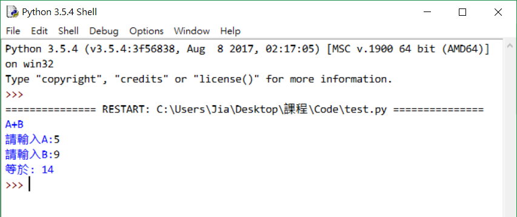

## Python 題目測試~

1. 寫個字串連接，並讓使用者輸入兩個字串，輸出字串連接結果。 

2. 產生字三角形(1)由小到大；(2)由大到小；(3)由使用者輸入數字 

3. 做一個簡單的加法，讓使用者輸入A跟B，結果輸出A+B。 

4. 延續上一題，如果結果大於等於100，則輸出’總和大於等於100’； 
如果結果大於等於10但不到100，則輸出’總和大於等於10’； 
如果結果小於10，則輸出’總和小於10’。 

5. 輸入數字num，利用for迴圈計算1加至num的總和。 

6. 輸入一個整數num，while迴圈判斷累加到多少會超過num。 
(ex:num=4  1+2+3=6  6超過num) 

