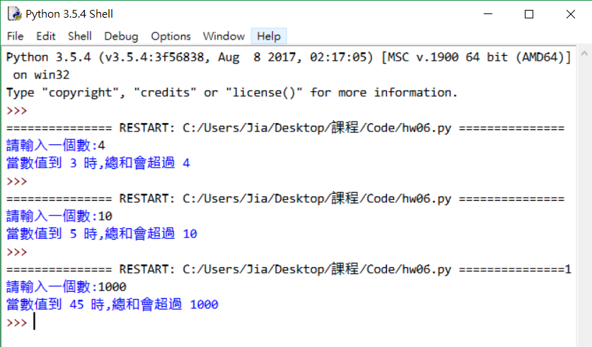
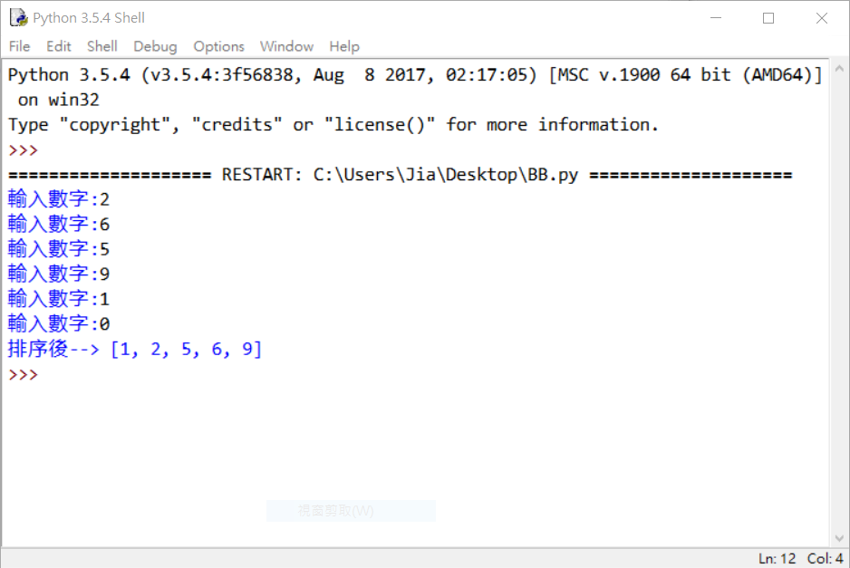
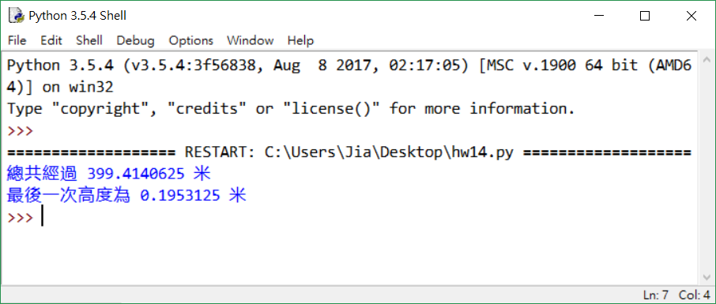

## Python 題目測試~

[[回首頁]](../README.md) 

----
1. 寫個字串連接，並讓使用者輸入兩個字串，輸出字串連接結果。 

2. 產生字三角形(1)由小到大；(2)由大到小；(3)由使用者輸入數字 

3. 做一個簡單的加法，讓使用者輸入A跟B，結果輸出A+B。 

4. 延續上一題，如果結果大於等於100，則輸出’總和大於等於100’； 
如果結果大於等於10但不到100，則輸出’總和大於等於10’； 
如果結果小於10，則輸出’總和小於10’。 

5. 輸入數字num，利用for迴圈計算1加至num的總和。 

6. 輸入一個整數num，while迴圈判斷累加到多少會超過num。 
(ex:num=4  1+2+3=6  6超過num) 

7. 判斷是不是閏年。是的話輸出”閏年”；不是的話輸出”平年”。 
(提示:西元年被4整除且不被100整除，或被400整除者即為閏年) 

8. 簡單的計算機，第一步讓使用者輸入想要做的符號運算，比如「+, -, *, /」，第二步讓使用者輸入'整數1'和'整數2'，最後讓這兩個整數進行運算。 
如果輸入的運算符號不是「+, -, *, /」，便輸出「錯誤」。 

9. 使用for迴圈顯示出99乘法表。 
(提示:可以用format 格式化函數美化) 

10. 鉛筆一支 5 元，一打 50 元。小明需要幫班上每位同學買一枝鉛筆，請問要多少錢？ 
(鉛筆數量一定等於班上的人數)使用者輸入班級人數。 

11. 使用者可一直輸入數字，直到輸入0則停止輸入，並輸出排序後的結果。 
(提示:排序可用list.sort()) 

12. 輸入三筆數字，如果可以排成三角形輸出’O’，否則輸出’X’。 
(如需排序可用list.sort()) 

13. 列印出所有的“水仙花數”，所謂“水仙花數”是指一個三位元數，其各位數字立方和等於該數本身。 
   例如：153是一個“水仙花數”，因為153=1的三次方＋5的三次方＋3的三次方。 
   (利用for迴圈控制100-999的數，每個數分解出個位，十位，百位。) 

14. 一球從100米高度自由落下，每次落地後反跳回原高度的一半；再落下，求它在第10次落地時，共經過多少米？第10次反彈多高？ 

15. 3025這個數字有個巧合，如果你將這數字看成字串，將其分為兩半(30和25)，則其和平方(30+25)^2 = 3025 
又變成原來的數字了。 
你的題目是找出這種類似的巧合數字出來，你的程式要讀取一個位數(2、4、6、或8)，然後找出該位數的所有類似巧合的數字。 
例如4位數，從0000到9999。請注意，0也要算在內，也就是說0001也等於(00+01)^2，也是4位數中的巧合數。 

