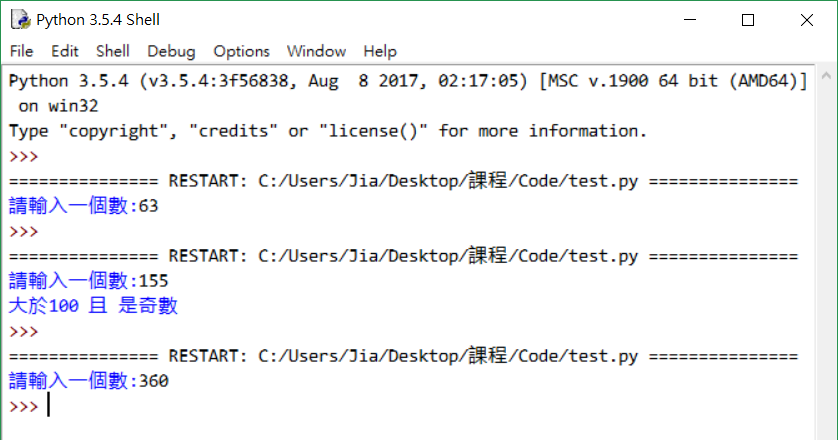

# Python程式教學02

[[回首頁]](../README.md)<br/>

----
### if多條件組合
例如: if (口渴 且 有錢):  買飲料喝<br/>
>>if(口渴 and 有錢):  買飲料喝<br/>

例如: if (半夜 或 疲倦):  睡覺<br/>
>>if (半夜 or 疲倦):  睡覺<br/>

範例：輸入整數，判斷該數是否大於100且為奇數 (除2時餘數為1)。<br/>
<br>
```python
a=int(input('請輸入一個數:'))

if a>100 and a%2==1:
    print('大於100 且 是奇數')
```

### while迴圈
一直執行直到不符合條件。
```python
x = 0
while x < 5:
    print('x is less than 5')
    x += 1
```

### break、continue
在for、while迴圈內，可使用關鍵字<br>
```continue```-跳出本次循環；<br>
```break```----跳出整個循環。<br>
```python
for i in range(10):
    if i==3:
        continue
    if i==6:
        break
    print(i)    # 0 1 2 4 5
```


