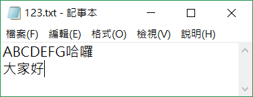
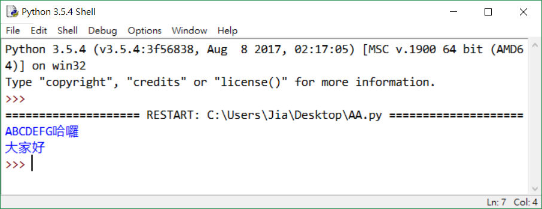

# Python程式教學04

[[回首頁]](../README.md)<br/>

----
### 三元運算子
如果if判斷式較簡單，可簡化成以下

```python
(輸出) = (條件為真) if (條件) else (條件為假)
```
```python
isTrue = True
state = "True" if isTrue else "not True"    #True

# 等於
isTrue = True
if isTrue:
    state = "True"
else:
    state = "not True"
```
```python
a,b=2,3
c=a if a>b else b
print(c)    #3
```
<br>

### 遞迴
在函式中自己呼叫自己叫做遞迴函式<br>
範例：n階層的遞迴
```python
def math_fuc(n):
    result = 0
    if n==0 or n==1:
        result = 1
    else:
        result = n*math_fuc(n-1)
    return result

for i in range(1,11):
    print(i,'階層=',math_fuc(i))
```
<br>

優點：<br>
遞迴使程式碼看起來更加整潔、優雅<br>
可以用遞迴將複雜任務分解成更簡單的子問題<br>

缺點:<br>
遞迴的邏輯較難除錯<br>
遞迴呼叫的代價高昂（效率低），因為佔用了大量的記憶體和時間<br>
<br>

### 例外處理
* 語法錯誤 (syntaxError)<br>
(if判斷式後面沒有```:```)<br>
<br>
* 沒有命名對象 (NameError)<br>
(```n```沒有命名)<br>
<br>
* 除零錯誤 (ZeroDivisionError)<br>
除數不可為0<br>
<br>
* ...<br>
<br>

#### try-except
```python
try:
    嘗試執行的程式
except 例外名稱 as 變數名稱:
    例外發生時執行的程式
else:
    若try沒產生例外則會執行這裡
finally:
    不管有沒有發生例外都會跑到的程式
```
except區塊可以多個，至少一個，as 變數名稱 可以用或不用，變數會儲存例外的狀況，<br/>
else與finally可選擇用或不用。<br/>
<br/>
例如:
```python
a = 12
b = int(input('b:'))
   
try:
    if a/b:
        print('等於:',a/b)
except ZeroDivisionError:
    print('發生除零錯誤')
else:
    print('沒發生除零錯誤')
finally:
    print('不管有沒有發生例外都會執行')
```
<br>
<br/>
<br/>

### 內建函數
|                                      |                                      |
| ------------------------------------ | ------------------------------------ |
| ```abs(x)```                         | 回傳 x 的絕對值                      |
| ```input([prompt])```                | 接受使用者的輸入， prompt 為提示字串 |
| ```len(s)```                         | 回傳複合資料型態的元素個數           |
| ```max(iterable[, args...])```       | 回傳參數中的最大值                   |
| ```min(iterable[, args...])```       | 回傳參數中的最小值                   |
| ```print([object, ...], end='\n')``` | 印出 object 的內容                   |
| ```range([start], stop[, step])```   | 建立整數序列                         |
| ```sum(iterable)```                  | 回傳迭代器 iterable 的總和           |
<br/>


### File(文件)
#### 開啟檔案
```python f = open('檔案', '模式') ```
| 模式 | 意思                                                         |
| ---- | ------------------------------------------------------------ |
| r    | 讀取(檔案需存在)                                             |
| w    | 新建檔案寫入(檔案可不存在，若存在則清空)                     |
| a    | 資料附加到舊檔案後面(游標指在EOF)                            |
| r+   | 讀取舊資料並寫入(檔案需存在且游標指在開頭)                   |
| w+   | 清空檔案內容，新寫入的東西可在讀出(檔案可不存在，會自行新增) |
| a+   | 資料附加到舊檔案後面(游標指在EOF)，可讀取資料                |
| b    | 二進位模式                                                   |

#### 讀取文件內容
```python f.read(size) ``` - 讀取size字串長度進來，若不填則讀取整份文件<br/>
```python f.readline() ``` - 讀取一行,最後面會加上一個 \n<br/>
```python f.readlines() ``` - 傳回一list ，每一行文字最後面會加上一個 \n 為一個list的資料項<br/>
#### 寫入檔案
```python f.write(string) ``` - 寫入檔案，並回傳寫入的string長度<br/>
#### 游標位置
```python f.seek(位移的bit數) ```<br/>
可指定從哪邊開始<br/>
```python f.seek(位移的bit數,0) ``` - 從文件開頭開始<br/>
```python f.seek(位移的bit數,1) ``` - 從目前游標位置開始<br/>
```python f.seek(位移的bit數,2) ``` - 從目前文件結尾開始<br/>
#### 關閉檔案
```python f.close() ```<br/>
簡單範例<br/>
```python 
f = open('123.txt', 'r+')
print(f.read())

f.write("string")

f.close()
```
123.txt檔案內容`<br/>
<br>
<br>

<br/>
