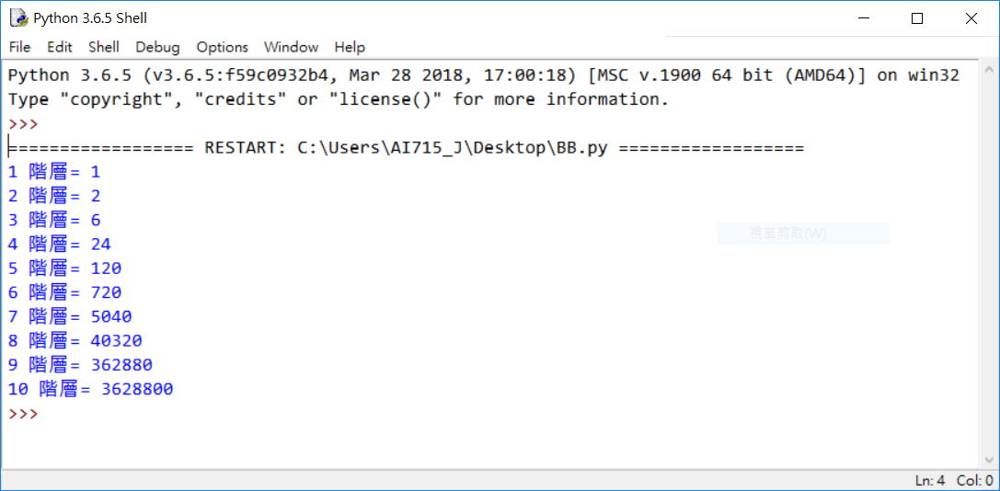
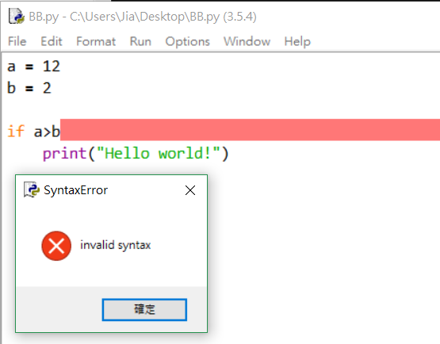
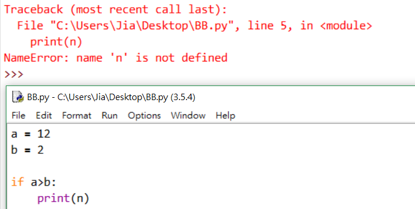
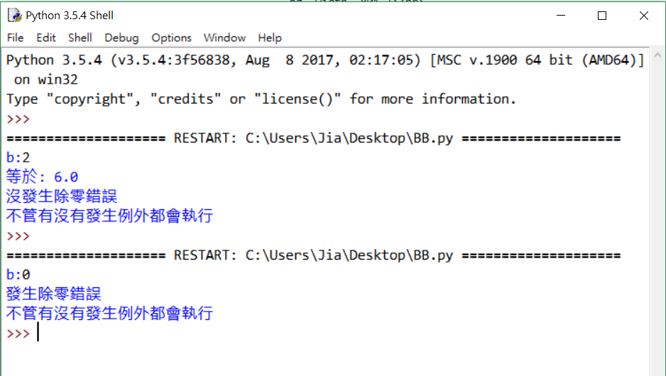

# Python程式教學04

[[回首頁]](../README.md)<br/>

----
### 例外處理
* 語法錯誤 (syntaxError)<br>
(if判斷式後面沒有```:```)<br>
<br>
* 沒有命名對象 (NameError)<br>
(```n```沒有命名)<br>
<br>
* 除零錯誤 (ZeroDivisionError)<br>
除數不可為0<br>
<br>
* ...<br>
<br>

#### try-except
```python
try:
    嘗試執行的程式
except 例外名稱 as 變數名稱:
    例外發生時執行的程式
else:
    若try沒產生例外則會執行這裡
finally:
    不管有沒有發生例外都會跑到的程式
```
except區塊可以多個，至少一個，as 變數名稱 可以用或不用，變數會儲存例外的狀況，<br/>
else與finally可選擇用或不用。<br/>
<br/>
例如:
```python
a = 12
b = int(input('b:'))
   
try:
    if a/b:
        print('等於:',a/b)
except ZeroDivisionError:
    print('發生除零錯誤')
else:
    print('沒發生除零錯誤')
finally:
    print('不管有沒有發生例外都會執行')
```
<br>
<br/>
<br/>

### File(文件)
<br/>
