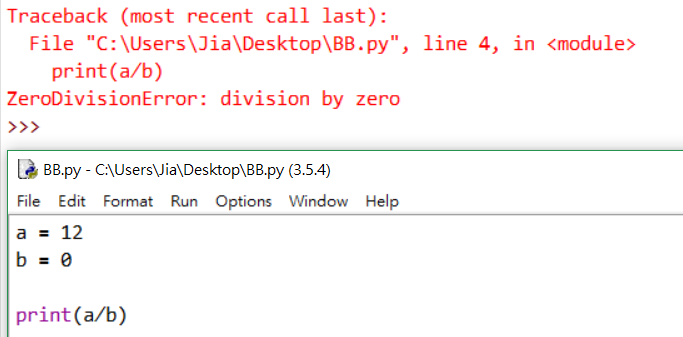

# Python程式教學04

[[回首頁]](../README.md)<br/>

----
### 三元運算子
如果if判斷式較簡單，可簡化成以下

```python
(輸出) = (條件為真) if (條件) else (條件為假)
```
```python
isTrue = True
state = "True" if isTrue else "not True"    #True

# 等於
isTrue = True
if isTrue:
    state = "True"
else:
    state = "not True"
```
```python
a,b=2,3
c=a if a>b else b
print(c)    #3
```
<br>

### 遞迴
在函式中自己呼叫自己叫做遞迴函式<br>
範例：n階層的遞迴
```python
def math_fuc(n):
    result = 0
    if n==0 or n==1:
        result = 1
    else:
        result = n*math_fuc(n-1)
    return result

for i in range(1,11):
    print(i,'階層=',math_fuc(i))
```
<br>

優點：<br>
遞迴使程式碼看起來更加整潔、優雅<br>
可以用遞迴將複雜任務分解成更簡單的子問題<br>

缺點:<br>
遞迴的邏輯較難除錯<br>
遞迴呼叫的代價高昂（效率低），因為佔用了大量的記憶體和時間<br>
<br>

### 例外處理
* 語法錯誤 (syntaxError)<br>
(if判斷式後面沒有```:```)<br>
<br>
* 沒有命名對象 (NameError)<br>
(```n```沒有命名)<br>
<br>
* 除零錯誤 (ZeroDivisionError)<br>
除數不可為0<br>
<br>
* ...<br>
<br>

#### try-except
```python
try:
    嘗試執行的程式
except 例外名稱 as 變數名稱:
    例外發生時執行的程式
else:
    若try沒產生例外則會執行這裡
finally:
    不管有沒有發生例外都會跑到的程式
```
except區塊可以多個，至少一個，as 變數名稱 可以用或不用，變數會儲存例外的狀況，<br/>
else與finally可選擇用或不用。<br/>
<br/>
例如:
```python
a = 12
b = int(input('b:'))
   
try:
    if a/b:
        print('等於:',a/b)
except ZeroDivisionError:
    print('發生除零錯誤')
else:
    print('沒發生除零錯誤')
finally:
    print('不管有沒有發生例外都會執行')
```
<br>
<br/>
<br/>

### File(文件)
<br/>
