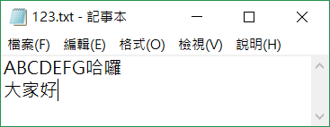
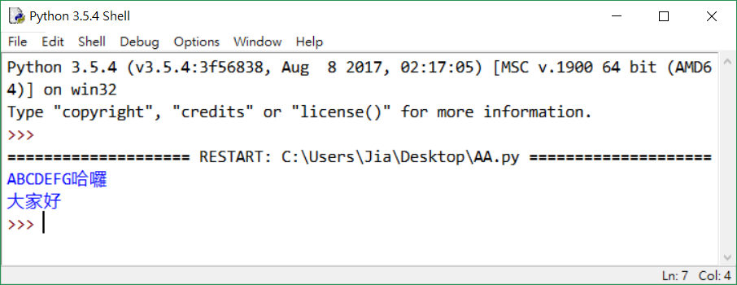

# Python程式教學05

[[回首頁]](../README.md)<br/>

----
### File(文件)
#### 開啟檔案
```python f = open('檔案', '模式') ```<br/>

| 模式 | 意思                                                         |
| ---- | ------------------------------------------------------------ |
| r    | 讀取(檔案需存在)                                             |
| w    | 新建檔案寫入(檔案可不存在，若存在則清空)                     |
| a    | 資料附加到舊檔案後面(游標指在EOF)                            |
| r+   | 讀取舊資料並寫入(檔案需存在且游標指在開頭)                   |
| w+   | 清空檔案內容，新寫入的東西可在讀出(檔案可不存在，會自行新增) |
| a+   | 資料附加到舊檔案後面(游標指在EOF)，可讀取資料                |
| b    | 二進位模式                                                   |
<br/>

#### 讀取文件內容
```python f.read(size) ``` - 讀取size字串長度進來，若不填則讀取整份文件<br/>
```python f.readline() ``` - 讀取一行,最後面會加上一個 \n<br/>
```python f.readlines() ``` - 傳回一list ，每一行文字最後面會加上一個 \n 為一個list的資料項<br/>
#### 寫入檔案
```python f.write(string) ``` - 寫入檔案，並回傳寫入的string長度<br/>
#### 游標位置
```python f.seek(位移的bit數) ```<br/>
可指定從哪邊開始<br/>
```python f.seek(位移的bit數,0) ``` - 從文件開頭開始<br/>
```python f.seek(位移的bit數,1) ``` - 從目前游標位置開始<br/>
```python f.seek(位移的bit數,2) ``` - 從目前文件結尾開始<br/>
#### 關閉檔案
```python f.close() ```<br/>
簡單範例<br/>
```python 
f = open('123.txt', 'r+')
print(f.read())

f.write("string")

f.close()
```
123.txt檔案內容`<br/>
<br>
<br>
<br/>

### import 載入模組
載入別人、自己或內建寫好的模組。<br/>
import time 指載入time模組<br/>
```python
import time
print(time.localtime()) #這樣就可以print 當地時間了
```
可自定義模組名稱<br/>
```python
import time as t
print(t.localtime())    # 需要加t.前綴來引出功能
```
或者只載入需要的部分<br/>
```python
from time import time, localtime
print(localtime())
print(time())
```
#### time模組

| 序號 | 屬性     | 意思         | 值                                |
| ---- | -------- | ------------ | --------------------------------- |
| 0    | tm_year  | 4位數年      | 2018                              |
| 1    | tm_mon   | 月           | 1 到 12                           |
| 2    | tm_mday  | 日           | 1 到 31                           |
| 3    | tm_hour  | 小時         | 0 到 23                           |
| 4    | tm_min   | 分鐘         | 0 到 59                           |
| 5    | tm_sec   | 秒           | 0 到 61 (60或61 是閏秒)           |
| 6    | tm_wday  | 一周的第幾日 | 0到6 (0是周一)                    |
| 7    | tm_yday  | 一年的第幾日 | 1 到 366(儒略歷)                  |
| 8    | tm_isdst | 夏令時       | -1, 0, 1 是決定是否為夏令時的旗幟 |

asctime()
http://www.runoob.com/python/python-date-time.html


### 視窗
Tkinter是使用Python進行窗口視窗設計的模組，Python自帶的可編輯的GUI界面<br/>
#### 主體框架
```python
import tkinter as tk

window = tk.Tk()
window.title('my window')
window.geometry('200x100')

# 这里是窗口的内容

window.mainloop()
```

#### Label 標籤
```python
l = tk.Label(window, 
    text='OMG! this is TK!',    # 標籤的文本
    bg='green',                 # 背景顏色
    font=('Arial', 12),         # 字體和字體大小
    width=15, height=2）        # 標籤長寬
l.pack()    # 固定窗口位置
```

#### Button 按鈕
```python
var = tk.StringVar()    # 這時文本變量儲存器
l = tk.Label(window, 
    textvariable=var,   # 使用 textvariable 替換 text, 因為這個可以變化
    bg='green', font=('Arial', 12), width=15, height=2)
l.pack()

b = tk.Button(window, 
    text='hit me',      # 顯示在按鈕上的文本
    width=15, height=2, 
    command=hit_me)     # 點擊按鈕式執行的命令
b.pack()    # 按鈕位置

on_hit = False  # 默認初始狀態為 False
def hit_me():
    global on_hit
    if on_hit == False:          # 從 False 狀態變成 True 狀態
        on_hit = True
        var.set('you hit me')   # 設置標籤的文本為 'you hit me'
    else:   # 從 True 狀態變成 False 狀態
        on_hit = False
        var.set('') # 設置文本為空
```

<br/>

| 控件         | 描述                                                          |
| ------------ | ------------------------------------------------------------- |
| Button       | 讀取(檔案需存在)                                              |
| Canvas       | 畫布控件；顯示圖形元素如線條或文本                            |
| Checkbutton  | 多選框控件；用於在程序中提供多項選擇框                        |
| Entry        | 輸入控件；用於顯示簡單的文本內容                              |
| Frame        | 框架控件；在屏幕上顯示一個矩形區域，多用來作為容器            |
| Label        | 標籤控件；可以顯示文本和位圖                                  |
| Listbox      | 列錶框控件；在Listbox窗口小部件是用來顯示一個字符串列表給用戶 |
| Menubutton   | 菜單按鈕控件，由於顯示菜單項。                                |
| Menu         | 菜單控件；顯示菜單欄,下拉菜單和彈出菜單                       |
| Message      | 消息控件；用來顯示多行文本，與label比較類似                   |
| Radiobutton  | 單選按鈕控件；顯示一個單選的按鈕狀態                          |
| Scale        | 範圍控件；顯示一個數值刻度，為輸出限定範圍的數字區間          |
| Scrollbar    | 滾動條控件，當內容超過可視化區域時使用，如列錶框。            |
| Text         | 文本控件；用於顯示多行文本                                    |
| Toplevel     | 容器控件；用來提供一個單獨的對話框，和Frame比較類似           |
| Spinbox      | 輸入控件；與Entry類似，但是可以指定輸入範圍值                 |
| PanedWindow  | 是一個窗口佈局管理的插件，可以包含一個或者多個子控件。        |
| LabelFrame   | 是一個簡單的容器控件。常用與復雜的窗口佈局。                  |
| tkMessageBox | 用於顯示你應用程序的消息框。                                  |
