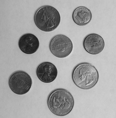
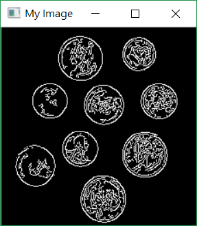
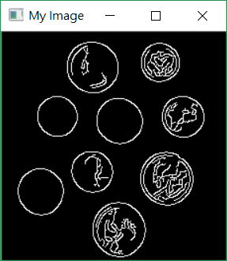

# Python程式教學06

[[回首頁]](../README.md)<br/>

----
### OpenCV
#### 安裝OpenCV
https://www.lfd.uci.edu/~gohlke/pythonlibs/#opencv<br>
選擇適合的下載<br>
其中"opencv_python‑3.4.1‑cp36‑cp36m‑win_amd64.whl"的cp36是指Python的版本、win_amd64是指64位元。<br>
並複製到Python安裝路徑下\Lib\site-packages，在此路徑打開CMD，執行```pip install opencv_python‑3.4.1‑cp36‑cp36m‑win_amd64.whl```<br>

#### 安裝Numpy
CMD中執行```pip install numpy```<br>

在Python中測試是否安裝成功<br>
```python
import numpy as np
import cv2
```
如果沒有錯誤訊息就表示安裝成功<br>

#### 基本功能
| 語法                          | 用途         |
| ----------------------------- | ------------ |
| ```cv2.imread()```            | 讀取圖片     |
| ```cv2.imshow()```            | 顯示圖片     |
| ```cv2.imwrite()```           | 寫入圖檔     |
| ```cv2.waitKey()```           | 偵測按鍵     |
| ```cv2.destroyAllWindows()``` | 關閉所有視窗 |
| ```cv2.destroyWindow()```     | 關閉特定視窗 |

```python
# 首先引入 NumPy 與 OpenCV 的 Python 模組：
import numpy as np
import cv2

# 讀取圖檔
img = cv2.imread('123.jpg')

# 顯示圖片
cv2.imshow('My Image', img)

# 按下任意鍵則關閉所有視窗
cv2.waitKey(0)
cv2.destroyAllWindows()
```

#### 轉換色彩
```python
img = cv2.cvtColor(img, cv2.COLOR_BGR2GRAY) #BGR轉Gray
```

#### 找邊緣
dst = cv2.Canny(InputArray src, double threshold1, double threshold2, int apertureSize=3, bool L2gradient=false)<br>
src：輸入圖，單通道8位元圖。<br>
dst：輸出圖，尺寸、型態和輸入圖相同。<br>
threshold1：第一個閾值。<br>
threshold2：第二個閾值。<br>
apertureSize ：Sobel算子的核心大小。<br>
L2gradient ：梯度大小的算法，預設為false<br>
```python
canny = cv2.Canny(blurred, 30, 150)
```
* 輸入圖須為單通道，也就是說要先轉為灰階

#### 高斯模糊
dst = cv2.GaussianBlur(const Mat &src, Size ksize, double sigmaX, double sigmaY)<br>
src：輸入可以為多通道圖，會單獨處理各通道，但是通常使用單通道灰階圖。<br>
dst：輸出圖會和輸入圖尺寸、型態相同。<br>
ksize：模板大小，長寬可以不同，但是都必須為正的奇數。<br>
sigmaX：x方向的標準差。<br>
sigmaY：y方向的標準差。<br>
```python
blurred = cv2.GaussianBlur(gray, (5, 5), 0)
```
<br>
原圖<br>
<br>
直接找邊緣<br>
<br>
先模糊再找邊緣<br>
<br>
<br>


